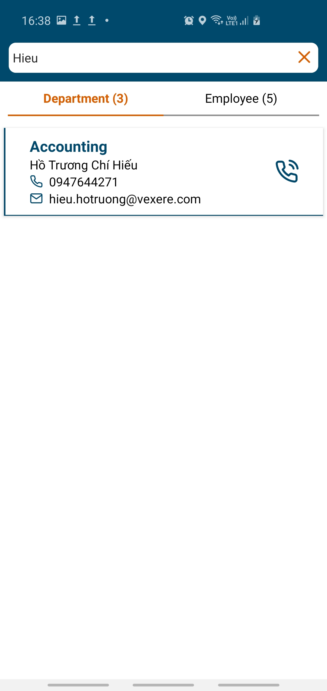
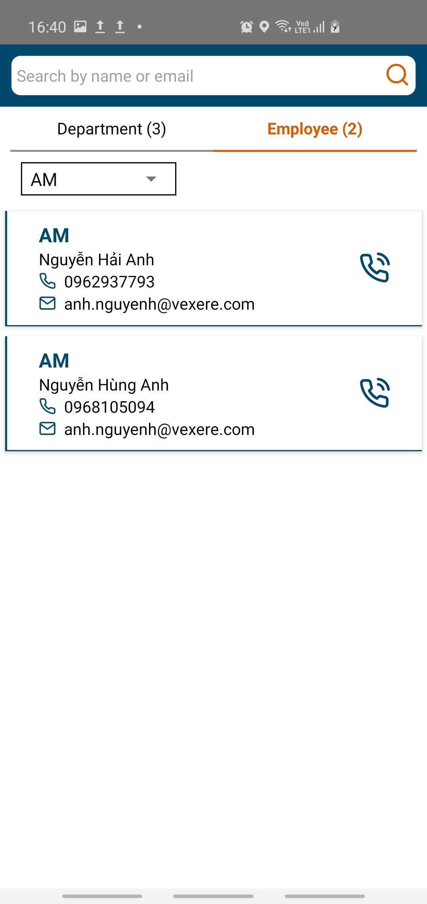

# veha = VeXeRe Employee Happiness

At VeXeRe, we believe all office workers are deserved to have a happy life at office, where they have been spending half of their life time. That's why we made this app.

At VeXeRe, we feel thankful because of the giving spirit of the open source community, that's why we decided to make this app open-source as well, to pay it back to community. And we are planning to give more and more.

# Brief 
An HR app, app for employee that aims to boost employee happiness, but without being a standard HR functional mobile application.

<table style="width:100%">
  <tr>
    <th>Main screen</th>
    <th>Search screen</th>
    <th>Department view screen</th>
  </tr>
  <tr>
    <td></td>
    <td></td>
    <td></td>
  </tr>
</table>

# Roadmap

Phase 1
* Manage employee by google sheet, example template can be seen here https://docs.google.com/spreadsheets/d/1i-0Tq2Bc5lzJqoizxMeBA95dgQDSkmHLXt6eWLv94Cc/edit#gid=0
* Login by Google account. When it is used by company, should add the check for domain name fit with your company's domain name (for example @vexere.com in long.luong@vexere.com) before giving access to employee information. For demo purpose that part was stripped (will add a small feature to allow configuration domain name soon)
* User can search for a college by name and see their detail info such as department, birthday, mobile phone ... and make phone call

Phase 2
* Push notification for HR to broadcast information to all employees
